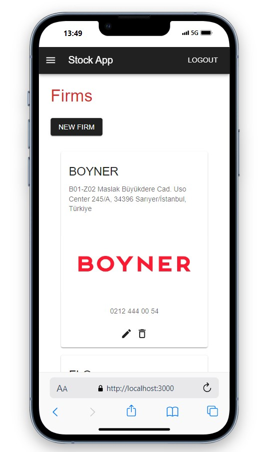
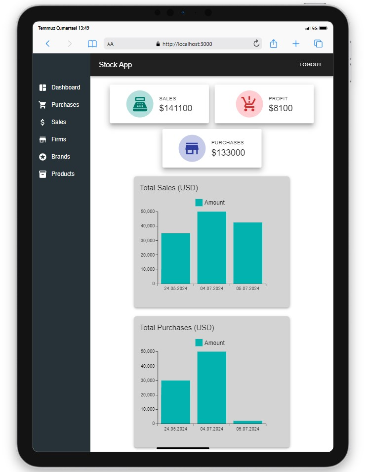
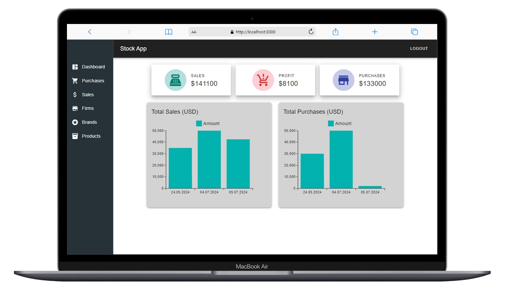

# Stock App with Nextjs

<div align="center">
  
</div>

## About the Project

This project, developed with Nextjs, is a single-page online web application. It allows you to manage and receive orders. Additionally, it includes an inventory system with the ability to add, edit, delete, and view products, companies, brands, sales, and purchases.

<p>E-Mail: admin@site.com,</p>
<p>Password: aA?123456,</p>

## Table of Contents

- [Features](#features)
- [Technologies Used](#technologies-used)
- [Usage](#usage)
- [Project Skeleton](#project-skeleton)
- [Screenshots](#screenshots)

## Live Demo

[Stock App with Nextjs](https://stock-app-with-nextjs.vercel.app/)

## Backend

- [Live](https://stock-api-drab.vercel.app/)
- [Codes](https://github.com/furkan-dogu/StockAPI)

## Features

- Login and register operations
- Pagination for smooth transitions between pages.
- Dashboard section where purchases and sales sections are tabulated
- Purchases, sales, firms, brands and product sections that you can add, delete and update yourself

## Technologies Used

- React
- Nextjs
- Redux
- Redux-Toolkit
- Axios for API requests
- Styling with [Material UI](https://mui.com/)
- [React-Toastify](https://fkhadra.github.io/react-toastify/introduction/) for alert 
- [Redux-Persist](https://www.npmjs.com/package/redux-persist) for status data retention.
- [Formik](https://formik.org/) for form management 
- [Yup](https://www.npmjs.com/package/yup) for form validation processes

## Usage

- Create your registration from the Register section and log in from the login section
- Pagination for smooth transitions between pages.
- Create your own stock
- Add, delete and update purchases, sales, firms, brands and product sections

## Project Skeleton

```
Stock App with Nextjs (folder)
│
├── app
│    ├── (private)
│    │     └── stock 
│    │          ├── brands
│    │          │     ├── components
│    │          │     │     ├── BrandCard.jsx
│    │          │     │     └── BrandModal.jsx
│    │          │     └── page.jsx     
│    │          ├── firms
│    │          │     ├── components
│    │          │     │     ├── FirmCard.jsx
│    │          │     │     └── FirmModal.jsx
│    │          │     └── page.jsx    
│    │          ├── products
│    │          │     ├── components
│    │          │     │     ├── ProductCard.jsx
│    │          │     │     └── ProductModal.jsx
│    │          │     └── page.jsx    
│    │          ├── purchases
│    │          │     ├── components
│    │          │     │     ├── PurchaseCard.jsx
│    │          │     │     └── PurchaseModal.jsx
│    │          │     └── page.jsx    
│    │          ├── sales
│    │          │     ├── components
│    │          │     │     ├── SaleCard.jsx
│    │          │     │     └── SaleModal.jsx
│    │          │     └── page.jsx    
│    │          ├── layout.jsx        
│    │          └── page.jsx    
│    ├── (public)
│    │     └── register 
│    │           └── page.jsx
│    ├── layout.js    
│    └── page.js    
├── assets
│    └── [images]
├── components
│    ├── Charts.jsx
│    ├── KPI.jsx
│    └── LoadingAndErrorMsg.jsx
├── helpers
│    ├── menuIcons.js
│    └── ToastNotify.jsx
├── hooks
│    ├── useAuthCalls.jsx
│    ├── useAxios.jsx
│    └── useStockCalls.jsx
├── public
│    └── [favicon]
├── redux
│    ├──  features
│    │      ├── AuthSlice.jsx
│    │      └── StockSlice.jsx
│    ├── provider.jsx
│    └── store.jsx
├── .gitignore
├── jsconfig.json
├── next.config.mjs
├── package-lock.json
├── package.json
└── README.md
```

## Screenshots

<div align="center">
  
  
  
</div>

## Compatibility

The project is compatible with both wide-screen computers and mobile devices.